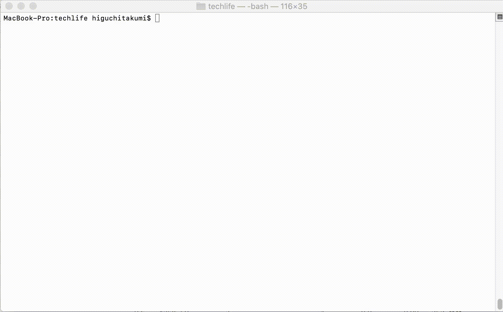

# Simple_Bitcoin_hash_generation
 Simple_Bitcoin_hash_generationは、すでにマイニングされたブロックを用いて擬似的にマイニングすることで、ビットコインのマイニングの仕組みを学習できるプログラムです。

 
# DEMO
 
 
  プログラム内に記述された、すでにマイニングされたブロック情報からハッシュを計算して、bitsから求められるtargetより小さい値が求まるまでハッシュを生成し続けます。

# Requirement
 * Python 2.7.16
 
# Usage
 実行には以下のコマンドを入力してください。
```bash
git clone https://github.com/TakumiHiguchi/bitcoin-hash-generation.git
cd bitcoin-hash-generation
python hash.py
```
また、初期値では614595ブロック目のブロックヘッダの情報が変数に格納されています。

他のブロックでマイニングしたい場合は、　[blockchain.com](https://www.blockchain.com/btc/block/)　や、　[techlife.branchwith.com](https://techlife.branchwith.com/blockchain/btc_exproler)　などのBitcoin Exprolerから値を取得してください。

詳しい変更の方法は[ブログ](https://techlife.branchwith.com/article/2tXCIAcoyT4uUdMCoJs0)をご覧ください。
 
 
# Author
 
* TakumiHiguchi
* Twitter : https://twitter.com/taku_blockchain
* Portfolio : https://techlife.branchwith.com/portfolio
 


